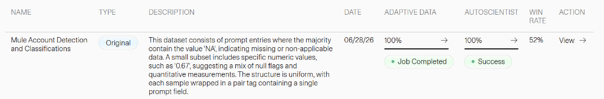
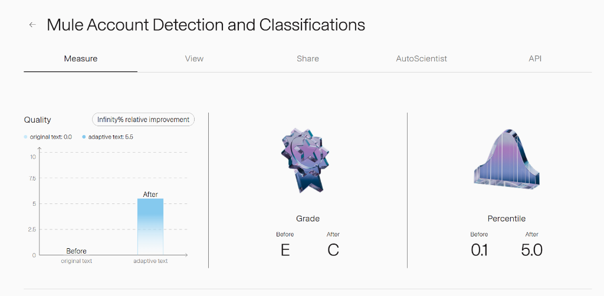
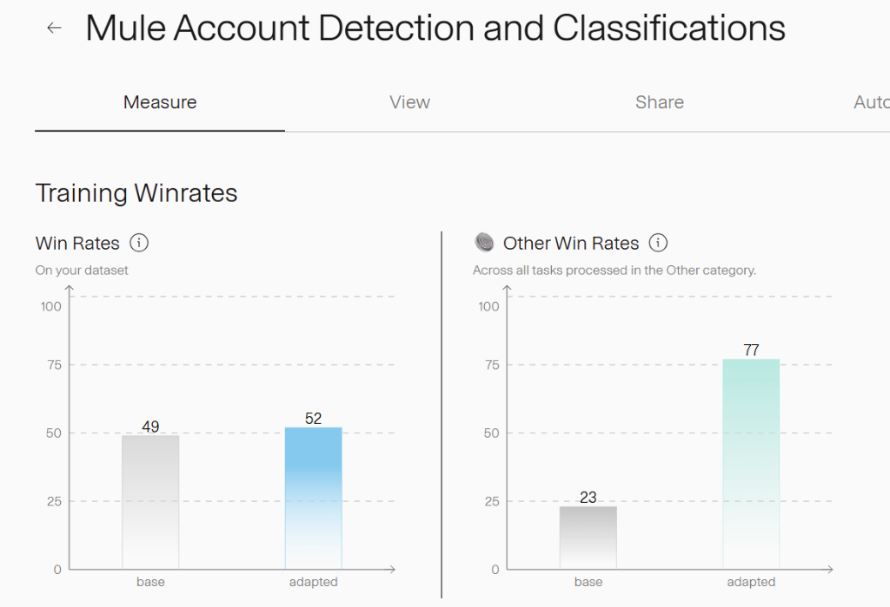

This dataset is a remastered version prepared using [Adaption's](https://adaptionlabs.ai/app/auth) Adaptive Data platform.
You can view the full dataset and performance measures on the [Adaption Platform](https://adaptionlabs.ai/app/dataset/c3e61929-b5da-4e34-bb79-c925d1a1ad33?tab=measure).

# Mule Account Detection and Classifications

### Dataset Overview

### Quality & Grade Improvement

### Training Winrates

---

### Dataset size

There are 27,957 data points in this dataset. This is an instruction tuning dataset.

### Quality of Remastered Dataset

The final quality is C, with a relative quality improvement of 0.0%.

### Domain
- other
- math

### Language
- Bosnian (78%)
- English (14%)
- Basque (8%)

### Tone
- Clear (64%)
- Analytical (8%)
- Helpful (8%)

### Tags

- automl
- data cleaning
- english
- Other (90%)
- Math (8%)
