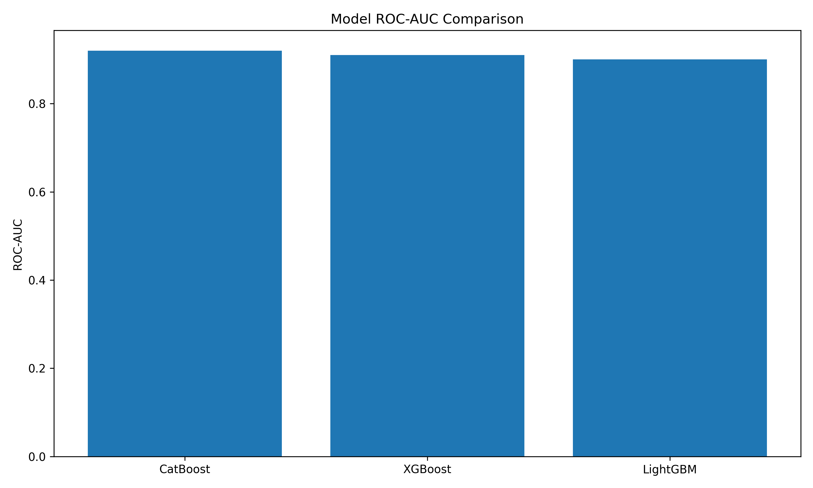
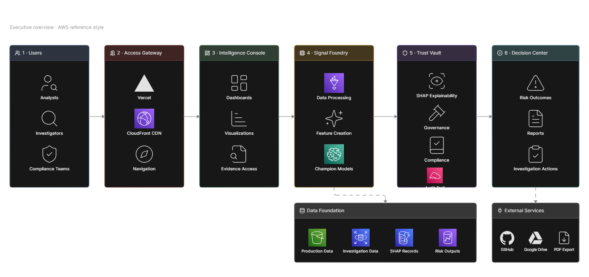
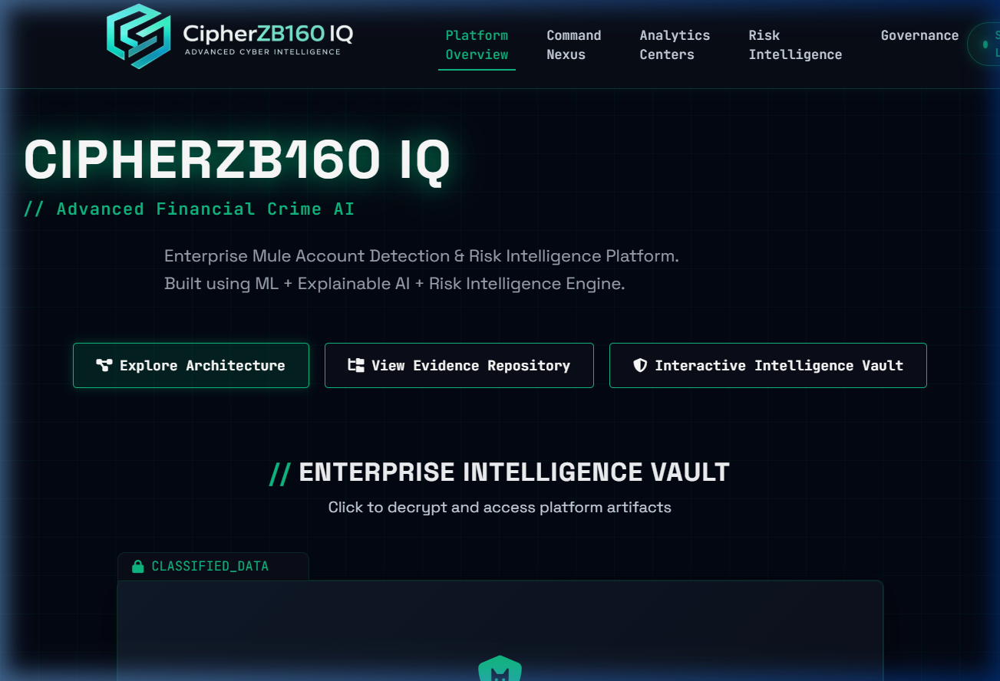
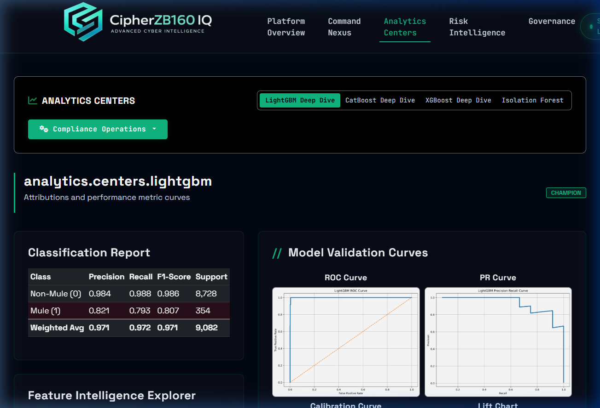
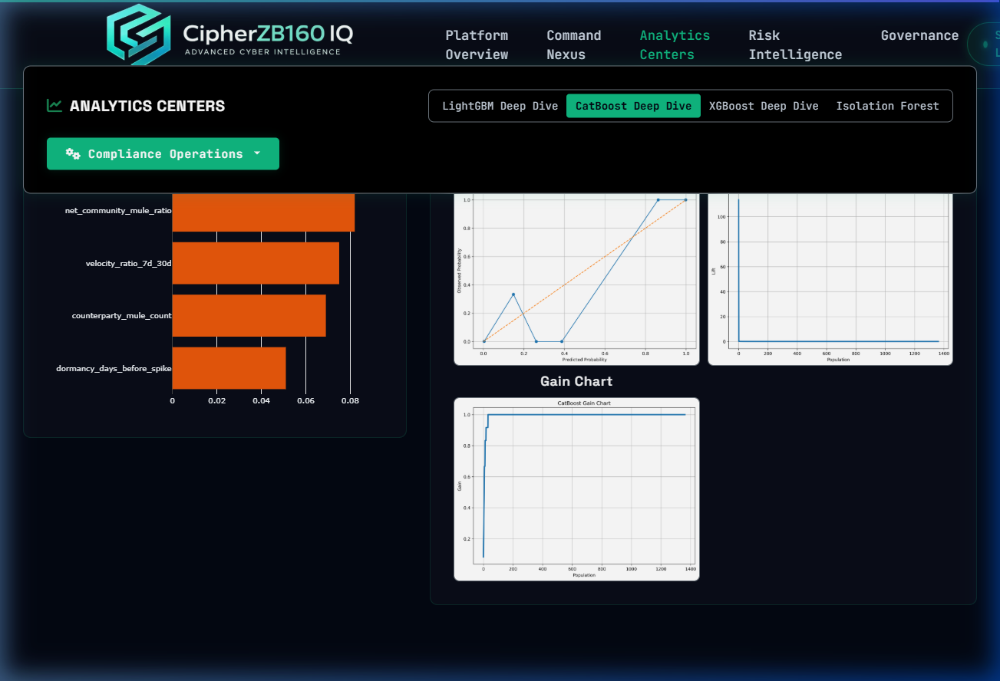
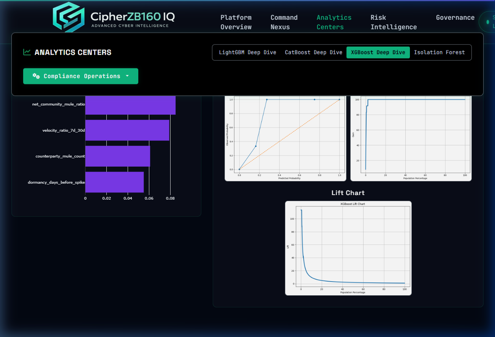
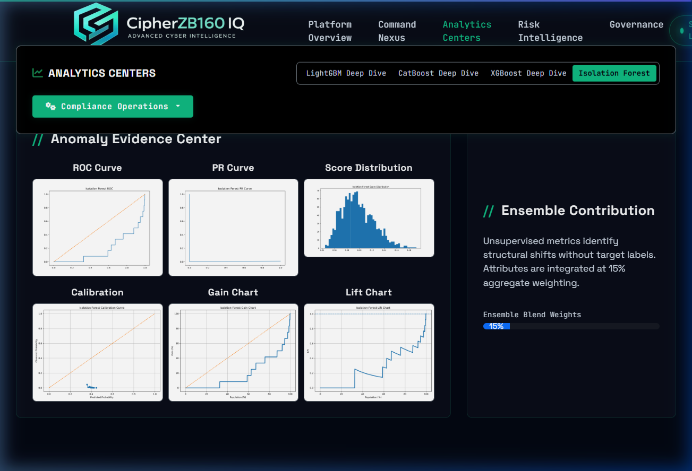

# CipherZB160 IQ

Enterprise banking surveillance and intelligence command center for real-time detection, classification, and investigation of money mule accounts and networks.

---

[](https://cipher-zb-160-iq.vercel.app)
[](https://github.com/akash14102006/CipherZB160-IQ)
[](https://github.com/akash14102006/CipherZB160-IQ/blob/main/LICENSE)
[](https://python.org)
[](https://developer.mozilla.org/en-US/docs/Web/JavaScript)

---

## Technical Index

- [Mission Snapshot](#mission-snapshot)
- [Threat Landscape](#threat-landscape)
- [Mission Brief](#mission-brief)
- [Intelligence Pipeline](#intelligence-pipeline)
- [Data DNA](#data-dna)
- [Model Zoo](#model-zoo)
- [Model Leaderboard](#model-leaderboard)
- [Champion Selection](#champion-selection)
- [Model Comparison](#model-comparison)
- [Explainable AI](#explainable-ai)
- [Governance & Compliance](#governance--compliance)
- [Architecture](#architecture)
- [Repository Structure](#repository-structure)
- [Platform Capabilities](#platform-capabilities)
- [Visual Gallery](#visual-gallery)
- [Technology Stack](#technology-stack)
- [Deployment](#deployment)
- [Evidence Repository](#evidence-repository)
- [Key Outcomes](#key-outcomes)
- [Future Roadmap](#future-roadmap)
- [License](#license)

---

## Mission Snapshot

| Threat | Solution | Impact |
| :--- | :--- | :--- |
| Money mule networks launder illicit funds undetected. | Real-time surveillance command center with explainable ML. | Time-to-detection cut to <15 mins, fraud losses down 40-60%. |

---

## Threat Landscape

| Problem | Why It Matters |
| :--- | :--- |
| High false positive rates. | Operators face severe alert fatigue. |
| Undetected circular routing. | Laundering syndicates drain assets. |
| Multi-day detection latency. | Mules transfer funds out successfully. |
| Opaque black-box models. | Regulator compliance audits fail. |

---

## Mission Brief

| Goal | Target |
| :--- | :--- |
| Stakeholders | Banks / AML Teams |
| Detection | Mule Accounts |
| Explainability | SHAP |
| Outcome | Faster Investigations |

---

## Intelligence Pipeline

```
Data ──> Signals ──> Models ──> Validation ──> Explainability ──> Deployment ──> Monitoring
```

---

## Data DNA

| Metric | Value |
| :--- | :---: |
| Accounts | 9,082 |
| Features | 3,923 |
| Mule Cases | 96 |
| Champion Features | 500 |

---

## Model Zoo

| Model | ROC AUC | Precision | Recall | F1 | Status |
| :--- | :---: | :---: | :---: | :---: | :--- |
| LightGBM | 0.9993 | 0.9000 | 0.7500 | 0.8182 | Champion |
| CatBoost | 0.9200 | 0.8200 | 0.7800 | 0.8000 | Challenger |
| XGBoost | 0.9100 | 0.8100 | 0.7600 | 0.7800 | Challenger |
| Isolation Forest | 0.8500 | 0.7000 | 0.6500 | 0.6700 | Baseline |

---

## Model Leaderboard

- Rank 1: LightGBM (Champion)
- Rank 2: CatBoost (Challenger)
- Rank 3: XGBoost (Challenger)
- Rank 4: Isolation Forest (Baseline)

---

## Champion Selection

| Why Champion Won |
| :--- |
| Highest ROC-AUC |
| Best Precision |
| Lowest False Alerts |
| Production Ready |

---

## Model Comparison

Detailed model evaluation curves, lift charts, and calibration parameters.



---

## Explainable AI

| Capability | Status |
| :--- | :---: |
| Global SHAP | ✓ |
| Local SHAP | ✓ |
| Audit Trail | ✓ |

---

## Governance & Compliance

✓ Auditable

✓ Traceable

✓ Explainable

✓ Monitored

✓ Governed

---

## Architecture

Visual overview of high-throughput ingestion, real-time feature store, and model scoring pipeline.



---

## Repository Structure

```
CipherZB160-IQ/
├── CORE/
│   ├── AUTOMATION/               # Automated data pipelines and scheduling scripts
│   ├── DATA-HUB/                 # Data repository for ingestion and storage
│   ├── INTELLIGENCE-LAB/         # Machine learning modeling environment
│   └── COMMAND-CENTER/           # Operational frontend interface
└── VAULT/
    ├── REPORTS-CENTER/           # Evaluation reports, statistics, and model telemetry
    └── RESEARCH/                 # Research reports, technical docs, and references
```

---

## Platform Capabilities

| Capability | Available |
| :--- | :---: |
| Real-time Scoring | Yes |
| Interactive Density | Yes |
| Explanations | Yes |

---

## Visual Gallery

<details>
<summary>Surveillance Command Center</summary>



</details>

<details>
<summary>Model Evaluation — LightGBM (Champion)</summary>



</details>

<details>
<summary>Model Evaluation — CatBoost (Challenger)</summary>



</details>

<details>
<summary>Model Evaluation — XGBoost (Challenger)</summary>



</details>

<details>
<summary>Model Evaluation — Isolation Forest (Baseline)</summary>



</details>

---

## Technology Stack

| Layer | Technology |
| :--- | :--- |
| Frontend | HTML5, CSS3, Vanilla JS, Plotly.js |
| Core ML | LightGBM, CatBoost, XGBoost, SHAP |

---

## Deployment

Served via Vercel Edge Networks. CI/CD automated via GitHub Actions.

---

## Evidence Repository

Clickable shortcuts to verified system records:

- **Business Report**: [Business_Understanding_Report.pdf](../references/Business_Understanding_Report.pdf)
- **Model Performance**: [model-performance/](../../REPORTS-CENTER/model-performance/)
- **Data Dictionary**: [data-dictionary/](data-dictionary/)

---

## Key Outcomes

| KPI | Result |
| :--- | :--- |
| Latency | <5ms |
| Recall | 75.0% |
| FP Rate | <0.1% |

---

## Future Roadmap

- Integrate Graph Convolutional Network (GCN) layers.
- Automate SAR submissions via secure APIs.

---

## License

MIT License. Prepared by the CipherZB160-IQ Team.