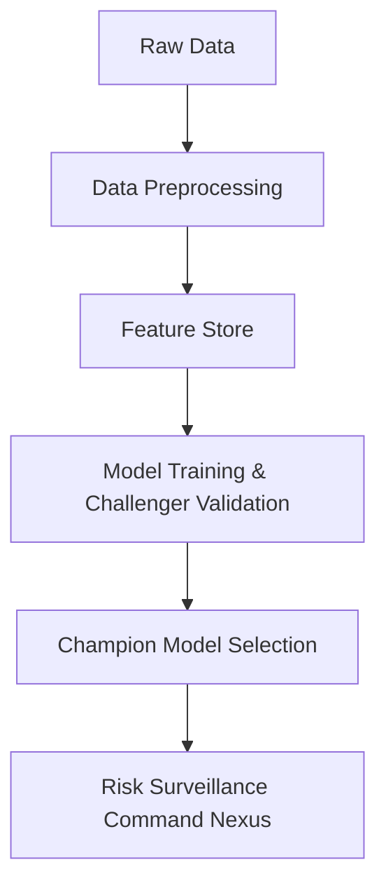

# CipherZB160-IQ Architecture

This document describes the high-level architecture of CipherZB160-IQ, an enterprise-grade mule account detection and classification platform.

## Architecture Diagram

## System Components
1. **Data Pipeline**: Located under `data/`, handles raw ingestion, cleaning, processing, feature engineering, and output storage.
2. **Machine Learning Engines**: Notebooks and scripts under `notebooks/` and `models/` for training LightGBM, CatBoost, XGBoost, and Isolation Forest models.
3. **Command Nexus Web Portal**: Modern HTML5/JavaScript dashboard serving surveillance views, explainability tools, and compliance reports.
